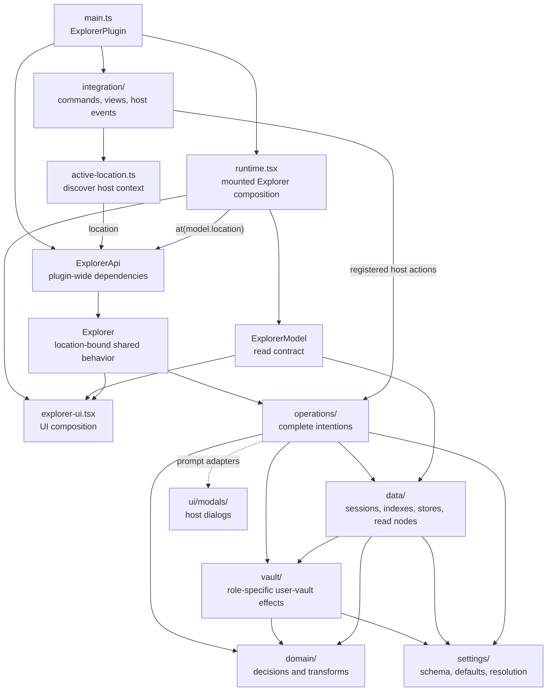

# Explorer Architecture Rules

The goal is to keep the plugin easy to change without loading the whole codebase
into your head. When in doubt, choose the option that keeps ownership obvious
from the file path.

This document is the architecture contract. Some of it is enforced by
`eslint.config.mjs`; the rest is convention.

## The Golden Rules

1. `main.ts` composes the plugin-wide services and host registrations.
   `src/explorer/runtime.tsx` composes each mounted Explorer, and
   `src/ui/explorer-ui.tsx` composes its rendered UI.
2. The mounted UI reads data from `ExplorerModel`. Every rendered UI mutation
   or navigation request crosses through a location-bound `Explorer`. Do not
   make view components reach around those contracts.
3. Backend core code is framework-free. React belongs in `src/ui/`,
   `src/explorer/runtime.tsx`, or `src/explorer/integration/`.
4. Lower backend layers do not import upward into roots or host integration.
5. Files are sorted by role, not by convenience. If a file starts doing two
   different jobs, split it.
6. Host registration lives in `integration/`. Domain decisions live below it.
7. New UI data goes into `model.ts`. User intentions go through the bound
   `Explorer`; mounted refresh remains a presentation concern driven by
   operation results.
8. UI structure and styling rules are governed by `STYLING.md`.
9. Raw user-vault mutations belong only in `vault/`. Operations own prompts,
   policy, notices, rollback sequencing, and post-success presentation.

## Current Shape



The bound API is the only public behavior surface for rendered UI and ordinary
user-action integrations. It owns file and folder opening, creation, moves,
renames, deletion, homepage and parent navigation, desired-state pinning, and
Markdown backing changes. Internal intention modules sequence policy, prompts,
vault effects, and workspace presentation. Boolean change results let mounted
UI invalidate its model without injecting React refresh callbacks into the
plugin-wide API.

## Backend Layers

Imports from core layers should point toward lower-level modules. Composition
roots and host integrations may wire those layers together.

```txt
main.ts
  Plugin composition root. Creates ExplorerApi once, owns settings and stores,
  and registers Obsidian-facing integrations.

src/explorer/runtime.tsx
  Mounted Explorer composition root. Owns session lifecycle, host
  subscriptions, model building, location binding, and UI mounting.

src/explorer/api.ts
  Plugin-owned public behavior façade. `ExplorerApi.at(location)` returns an
  `Explorer` bound to one explicit location; it never stores a mutable current
  location. Public request vocabulary is re-exported here rather than owned by
  an internal operation module.

src/explorer/integration/
  Obsidian-facing registration: commands, views, host event listeners, and DOM
  hooks. This layer may touch the host and may invoke runtime mounting for a
  host-owned view. Context discovery, such as the active Explorer location,
  stays here rather than entering the core API.

src/explorer/model.ts
  Data contract the UI reads, including derived display facts and the public
  read-node types implemented in `data/explorer-nodes.ts`. It does not expose
  behavior implementations.

src/explorer/operations/
  Complete user- or host-triggered intentions. Operations own prompts, policy,
  notices, rollback sequencing, workspace presentation, and translation of
  typed low-level results. Registered host actions such as reading-mode block
  insertion and folder-note rename synchronization enter here from
  `integration/`. Prompt implementations remain in `src/ui/modals/` as an
  intentional user-interaction adapter edge; operations do not otherwise
  depend on rendered UI.

src/explorer/domain/
  Dependency-light types, decisions, transforms, and effect ordering. This
  layer has no React, UI adapters, stateful data, operations, integration, or
  composition-root imports. `folder-page.ts`, `folder-page-opening.ts`,
  `markdown-backing-transition.ts`, `folder-rename.ts`, and
  `move-confirmation.ts` make policy and ordering testable without the host UI.

src/explorer/vault/
  The only low-level owner of user-vault mutations. Role-specific primitives
  create, rename, move, delete, and modify files, folders, frontmatter, and
  file content. They return typed outcomes or throw; they do not open modals,
  emit policy notices, register events, or present workspace leaves.
  `entry-creation.ts`, `entry-deletion.ts`, `entry-move.ts`,
  `entry-rename.ts`, and `pin-frontmatter.ts` identify their stored effect.
  `folder-note-file.ts` is the single low-level owner of conventional and
  explicit Markdown folder-note lookup, path resolution, creation/update,
  and Explorer-block reading. `entry-deletion.ts` owns the sole
  `FileManager.promptForDeletion()` call because that host API is Obsidian's
  deletion policy.

src/explorer/data/
  Stateful runtime data: session caches, indexes, transient navigation state,
  persistent data stores, and cached read nodes. UI consumes those nodes
  through the `model.ts` read contract rather than importing `data/` directly.
  `FolderDataStore.adapter.write()` persists plugin-private JSON; it is not a
  user-vault mutation and is intentionally outside the vault boundary.

src/explorer/settings/
  Dependency-light settings schema, defaults, migrations, and resolution.

```

## Intentional Edges

- Operations import the concrete prompt modals in `src/ui/modals/`. This is the
  explicit user-interaction adapter edge; policy and result handling stay in
  operations, while raw effects stay in `vault/`.
- `operations/update-explorer-block.ts` accepts a rendered section context from
  the mounted runtime because it is the complete mounted edit intention.
- `integration/commands.ts` uses `Editor.replaceRange()` for live-editor block
  insertion. This is intentionally not a Vault/FileManager mutation; its
  reading-mode counterpart calls the shared file-content operation.

Homepage ownership is deliberately split: read decisions are in
`domain/homepage.ts`, opening policy in `operations/open-homepage.ts`,
inline-title mutation in `operations/rename-homepage.ts`, and new-tab host
registration in `integration/homepage-new-tabs.ts`.

## UI Layers

```txt
src/ui/explorer-ui.tsx
  UI composition root. Chooses which rendered regions appear and passes the
  model, bound Explorer behavior, files, refresh callback, and context-menu
  wiring down.

src/ui/explorer-state.ts
  React state for the mounted UI: search, pagination, metadata refresh, and
  visible files.

src/ui/components/primitives/
  App-ignorant semantic components. They do not import explorer modules.

src/ui/components/note/
  Note-domain fragments and hooks shared by cards and lists.

src/ui/components/*.tsx
  Rendered UI regions: list, cards, folders, search, pagination, actions.

src/ui/components/interactions.ts
  Shared interaction bundles for drag/drop, context menus, and open behavior.

src/ui/modals/
  Obsidian modal implementations.
```

CSS ownership, tokens, and UI styling rules live in `STYLING.md`.

## Examples

### Create the plugin-wide API once

The plugin owns stable dependencies. Components and integrations receive this
instance; they do not construct their own API.

```ts
this.explorerApi = new ExplorerApi({
  app: this.app,
  folderDataStore: this.folderDataStore,
  getBlockDefaults: () => this.settings.defaultBlockSettings,
  getSettings: () => this.settings,
  saveSettings: () => this.saveSettings(),
});
```

### Bind where the location is known

The mounted runtime already has `model.location`, so it binds before rendering
the UI:

```tsx
<ExplorerUI model={model} explorer={explorerApi.at(model.location)} />
```

The UI calls the intention without repeating that location:

```ts
const canGoUp = explorer.canGoToParent();
await explorer.goToParent(false);
await explorer.openFolder(folder, { newLeaf: false });
```

`ExplorerLocation.file` is the source Markdown file for the mounted Explorer,
not the optional backing of the target folder page. It may be an ordinary note;
parent navigation uses that fact to distinguish “open this note's containing
folder” from “step above this folder page.”

### Keep host discovery outside the API

Commands and titlebar actions discover the active host context when the action
runs, then bind the same operation used by mounted UI:

```ts
const location = getActiveExplorerLocation(app);
const explorer = explorerApi.at(location);

if (explorer.canGoToParent()) {
  await explorer.goToParent();
}
```

Passing `false` is an explicit same-leaf request. Omitting the argument uses the
plugin's `goToParentInNewTab` setting.

### Use one behavior surface

```ts
await explorer.goToParent();
await explorer.openFile(file);
await explorer.openFolder(folder);
await explorer.createFolder();
await explorer.createNote();
await explorer.movePathIntoFolder(sourcePath, folder, fromFolderNote);
await explorer.renameFile(file);
await explorer.renameFolder(folder);
await explorer.deleteFile(file);
await explorer.deleteFolder(folder);
await explorer.openHomePage();
await explorer.setPinned(file, true);
await explorer.addMarkdownBacking(settings);
await explorer.removeMarkdownBacking(folder, settings);
```

The API remains a concrete intention vocabulary, not a generic dispatch method,
settings bag, or service locator. UI refreshes after successful boolean change
results; the API does not own mounted presentation state.

## Where Changes Go

- Pure transform, predicate, domain getter, or type helper: `src/explorer/domain/`.
- Settings schema or migration logic: `src/explorer/settings/`.
- Vault write: `src/explorer/vault/`.
- Session cache, index, or persistent data store: `src/explorer/data/`.
- User-facing flow that composes lower layers: `src/explorer/operations/`.
- Obsidian command, view, event listener, or host DOM hook:
  `src/explorer/integration/`.
- Data the UI needs to read: add it to `ExplorerModel`.
- UI or user-action integration behavior: add it to `ExplorerApi` and expose it
  on the location-bound `Explorer`.
- Rendered UI region: `src/ui/components/*.tsx`.
- Shared note UI: `src/ui/components/note/`.
- App-ignorant UI primitive: `src/ui/components/primitives/`.

## Smells

- A view or host integration imports an implementation route for behavior that
  is already exposed on the bound `Explorer`.
- A rendered UI module imports `operations/`, `vault/`, `data/`, or
  `integration/` rather than using a read contract or the bound `Explorer`.
- A core backend file imports React.
- A `domain/` file imports `data/`, `operations/`, `integration/`, `runtime`,
  or UI.
- A file both registers host behavior and implements domain logic.
- A UI primitive imports from `src/explorer/`.
- A change needs a clever filename because the folder does not explain the role.

## Enforced Checks

Run these before handing off code:

```sh
npm run lint
npm run lint:css
npm run build
```

`npm run lint` enforces the important architecture boundaries:

- core backend files cannot import React;
- core backend files cannot import upward into `runtime` or `integration`;
- `domain/` cannot import React, runtime, integration, operations, UI, or
  stateful data;
- data and vault files cannot import operations, integration, runtime, React,
  or UI implementations;
- UI cannot import operations, vault, data, or integration implementations;
- Vault/FileManager mutation member calls are forbidden outside
  `src/explorer/vault/`; plugin-private `adapter.write()` and live-editor
  `Editor.replaceRange()` are intentionally distinct APIs;
- UI primitives cannot import explorer modules;
- feature UI cannot use inline `style` props.
