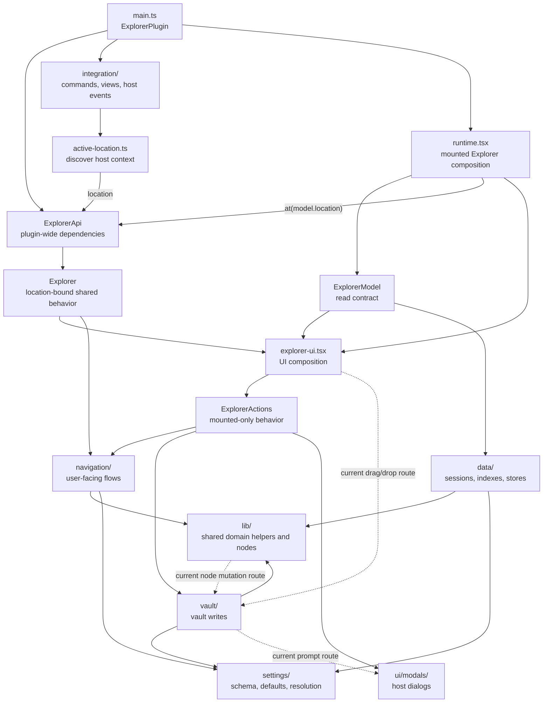

# Explorer Architecture Rules

The goal is to keep the plugin easy to change without loading the whole codebase
into your head. When in doubt, choose the option that keeps ownership obvious
from the file path.

This document is the architecture contract. Some of it is enforced by
`eslint.config.mjs`; the rest is convention.

## The Golden Rules

1. `main.ts` composes the plugin-wide services and host registrations.
   `src/explorer/runtime.tsx` composes each mounted Explorer, and
   `src/ui/explorer-ui.tsx` composes its rendered UI.
2. The mounted UI reads data from `ExplorerModel`. Shared user intentions cross
   through a location-bound `Explorer`; mounted-only behavior that has not been
   migrated yet remains in `ExplorerActions`. Do not make view components reach
   around those contracts.
3. Backend core code is framework-free. React belongs in `src/ui/`,
   `src/explorer/runtime.tsx`, or `src/explorer/integration/`.
4. Lower backend layers do not import upward into roots or host integration.
5. Files are sorted by role, not by convenience. If a file starts doing two
   different jobs, split it.
6. Host registration lives in `integration/`. Domain decisions live below it.
7. New UI data goes into `model.ts`. Shared user intentions go through the
   bound `Explorer`; behavior local to one mounted Explorer stays in
   `actions.ts` until another real surface needs it.
8. UI structure and styling rules are governed by `STYLING.md`.

## Current Shape



The bound API currently owns parent navigation, the first migrated shared
behavior. Other operations still use `ExplorerActions` or direct integration
calls while their caller sets are audited. Do not treat those transitional
routes as precedent for adding another route to parent navigation.

## Backend Layers

Imports from core layers should point toward lower-level modules. Composition
roots and host integrations may wire those layers together.

```txt
main.ts
  Plugin composition root. Creates ExplorerApi once, owns settings and stores,
  and registers Obsidian-facing integrations.

src/explorer/runtime.tsx
  Mounted Explorer composition root. Owns session lifecycle, host
  subscriptions, model building, location binding, and UI mounting.

src/explorer/api.ts
  Plugin-owned public behavior façade. `ExplorerApi.at(location)` returns an
  `Explorer` bound to one explicit location; it never stores a mutable current
  location.

src/explorer/integration/
  Obsidian-facing registration: commands, views, host event listeners, and DOM
  hooks. This layer may touch the host and may invoke runtime mounting for a
  host-owned view. Context discovery, such as the active Explorer location,
  stays here rather than entering the core API.

src/explorer/model.ts
  Data contract the UI reads.

src/explorer/actions.ts
  Transitional mounted-only UI behavior. Shared behavior belongs on the bound
  `Explorer`; keep remaining methods thin and migrate them only when a second
  surface needs the same intention.

src/explorer/navigation/
  User-facing flows that compose lower-level operations, such as opening folder
  notes, home pages, or virtual folder notes.

src/explorer/vault/
  Vault writes: create, rename, move, and modify files or blocks.

src/explorer/data/
  Stateful runtime data: session caches, indexes, and persistent data stores.

src/explorer/settings/
  Dependency-light settings schema, defaults, migrations, and resolution.

src/explorer/lib/
  Shared domain helpers and node types. This layer has no React, host
  registration, session store, navigation flow, or composition-root imports.
  Some existing node and folder-note helpers still cross into vault writes or
  UI prompts; those exceptions are listed below rather than presented as the
  desired dependency direction.
```

## Known Transitional Exceptions

The repository is not a perfectly acyclic layer graph yet. These current paths
are real and should be reduced when their behavior is next changed:

- `lib/nodes.ts` calls `vault/edit.ts` for node mutation.
- `lib/folder-note.ts`, `vault/create.ts`, and `vault/edit.ts` open prompt
  modals from `src/ui/modals/`.
- `actions.ts` opens confirmation UI directly.
- `src/ui/drag-drop.ts` imports the pure move predicate from `vault/move.ts`.
- Several integrations still call homepage, folder creation, virtual-folder,
  and pin behavior directly. Parent navigation is the only operation migrated
  to `ExplorerApi` so far.

Do not expand these exceptions casually. Prefer moving complete shared user
intentions behind `ExplorerApi`, keeping pure predicates below the caller, and
injecting prompts at a composition boundary when those areas are revised.

## UI Layers

```txt
src/ui/explorer-ui.tsx
  UI composition root. Chooses which rendered regions appear and passes the
  model, bound Explorer behavior, mounted actions, files, and context-menu
  wiring down.

src/ui/explorer-state.ts
  React state for the mounted UI: search, pagination, metadata refresh, and
  visible files.

src/ui/components/primitives/
  App-ignorant semantic components. They do not import explorer modules.

src/ui/components/note/
  Note-domain fragments and hooks shared by cards and lists.

src/ui/components/*.tsx
  Rendered UI regions: list, cards, folders, search, pagination, actions.

src/ui/components/interactions.ts
  Shared interaction bundles for drag/drop, context menus, and open behavior.

src/ui/modals/
  Obsidian modal implementations.
```

CSS ownership, tokens, and UI styling rules live in `STYLING.md`.

## Examples

### Create the plugin-wide API once

The plugin owns stable dependencies. Components and integrations receive this
instance; they do not construct their own API.

```ts
this.explorerApi = new ExplorerApi({
  app: this.app,
  getSettings: () => this.settings,
  saveSettings: () => this.saveSettings(),
});
```

### Bind where the location is known

The mounted runtime already has `model.location`, so it binds before rendering
the UI:

```tsx
<ExplorerUI model={model} explorer={explorerApi.at(model.location)} />
```

The UI calls the intention without repeating that location:

```ts
const canGoUp = explorer.canGoToParent();
await explorer.goToParent(false);
```

### Keep host discovery outside the API

Commands and titlebar actions discover the active host context when the action
runs, then bind the same operation used by mounted UI:

```ts
const location = getActiveExplorerLocation(app);
const explorer = explorerApi.at(location);

if (explorer.canGoToParent()) {
  await explorer.goToParent();
}
```

Passing `false` is an explicit same-leaf request. Omitting the argument uses the
plugin's `goToParentInNewTab` setting.

### Choose between `Explorer` and `ExplorerActions`

```ts
// Shared by toolbar, command palette, and titlebar: bound Explorer API.
await explorer.goToParent();

// Local to the mounted UI today: keep it on ExplorerActions.
await actions.renameFile(file);
```

Move an operation to `ExplorerApi` only when multiple surfaces share the same
user intention or the current access path is ambiguous. Do not add one-use
helpers to the façade.

## Where Changes Go

- Pure transform, predicate, domain getter, or type helper: `src/explorer/lib/`.
- Settings schema or migration logic: `src/explorer/settings/`.
- Vault write: `src/explorer/vault/`.
- Session cache, index, or persistent data store: `src/explorer/data/`.
- User-facing flow that composes lower layers: `src/explorer/navigation/`.
- Obsidian command, view, event listener, or host DOM hook:
  `src/explorer/integration/`.
- Data the UI needs to read: add it to `ExplorerModel`.
- Shared behavior used by UI and host integrations: add it to `ExplorerApi` and
  expose it on the location-bound `Explorer`.
- Mounted-only UI behavior: keep it in `ExplorerActions` until it has another
  real caller.
- Rendered UI region: `src/ui/components/*.tsx`.
- Shared note UI: `src/ui/components/note/`.
- App-ignorant UI primitive: `src/ui/components/primitives/`.

## Smells

- A view or host integration imports an implementation route for behavior that
  is already exposed on the bound `Explorer`.
- A core backend file imports React.
- A `lib/` file imports `data/`, `navigation/`, `integration/`, or `runtime`.
- A file both registers host behavior and implements domain logic.
- A UI primitive imports from `src/explorer/`.
- A change needs a clever filename because the folder does not explain the role.

## Enforced Checks

Run these before handing off code:

```sh
npm run lint
npm run lint:css
npm run build
```

`npm run lint` enforces the important architecture boundaries:

- core backend files cannot import React;
- core backend files cannot import upward into `runtime` or `integration`;
- `lib/` cannot import React, runtime, integration, navigation, or session data;
- UI and integration files cannot import the internal parent-navigation flow;
- UI primitives cannot import explorer modules;
- feature UI cannot use inline `style` props.
