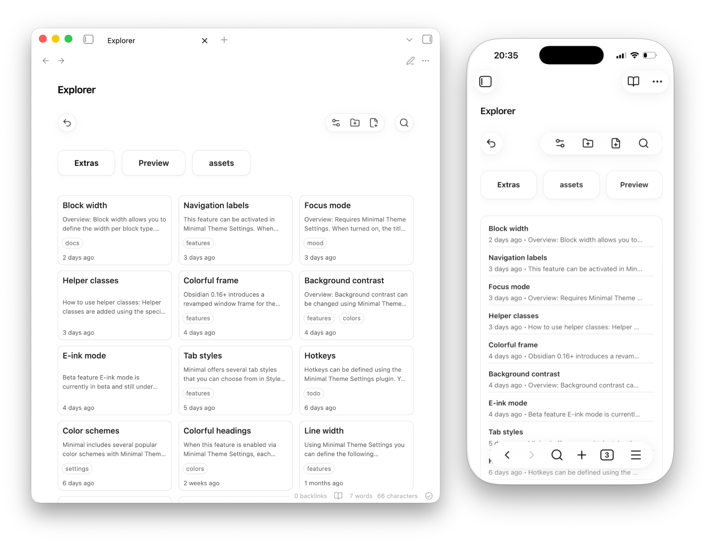
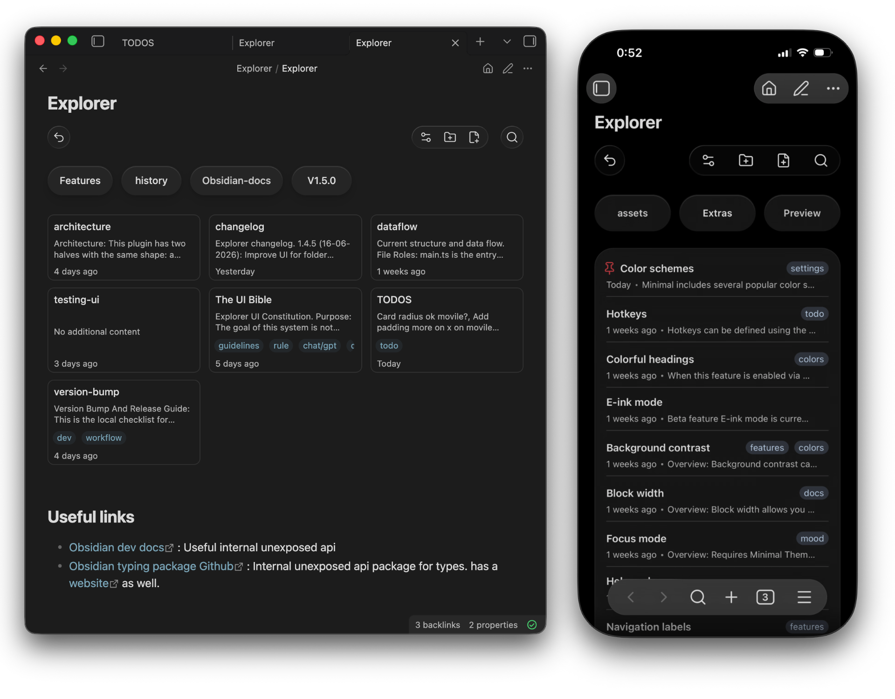
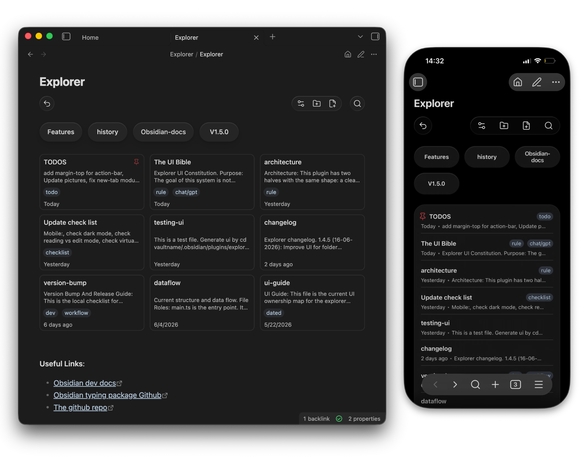
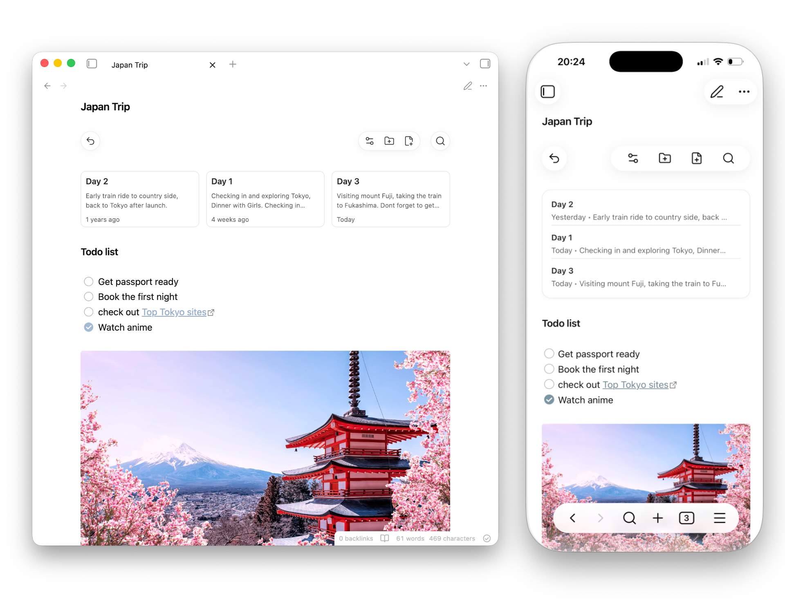
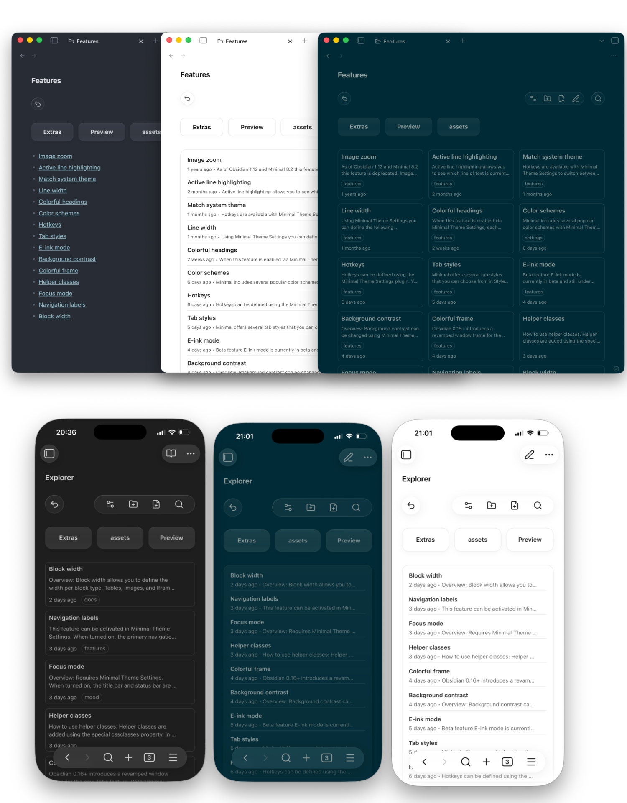
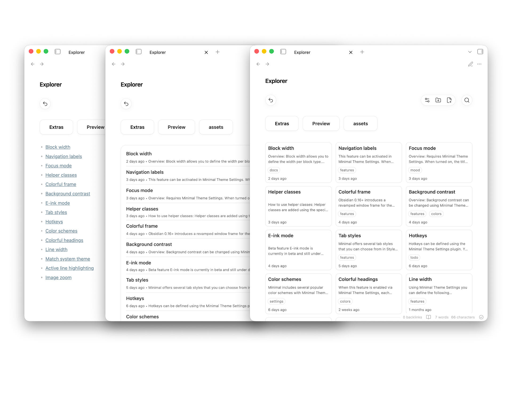

# Explorer

Browse and organize your vault from inside your notes.

Explorer turns folders into navigable overviews inside Obsidian's main editor
pane, so folders and notes can be browsed, edited, organized, and searched
from the same place you read and write.

Available in the [Obsidian community plugin store](https://community.obsidian.md/plugins/explorer).

<!--  -->

<!--  -->

<!--  -->



Explorer works best when folders act like notebooks, projects, classes, or
topic groups. It integrates with existing Markdown folder notes (Markdown files
that share the folder's name) and with Obsidian's built-in file explorer.

> **Note**
>
> Explorer works best as a main-pane navigator when **Use homepage** and **Open folder views from sidebar** are enabled.

## Highlights

- Open a folder overview from the homepage or by clicking a folder name in Obsidian's sidebar
- Create notes and folders from the action bar, move items with drag-and-drop, and rename, delete, or pin items from the context menu.
- Quickly navigate to the parent folder using the back button in the action bar
- Change sorting, visibility rules, and view settings from the action bar settings menu
- Search notes in the current folder overview
- Add text, images, tags, properties, and other content to folder overviews through Markdown folder notes. If a Markdown folder note does not yet exist, switch the folder overview to edit mode to create one automatically.

## Screenshots

### Folder overviews in Markdown



### Themes and devices



### Multiple view options



## Features

- Card and list views for folder contents
- Note previews in cards and modern list views, with per-block controls
- File-free folder overviews and writable Markdown folder notes
- Add or remove Markdown folder-note files with a single button in block settings
- Optional hiding of folder-note files in Obsidian's sidebar file tree
- Interactive folder navigation from the Obsidian sidebar
- Desktop drag-and-drop for moving notes and folders
- Context menu actions for moving folders, renaming and deleting items, and pinning notes
- Automatic folder and folder-note renaming synchronization on rename
- Optional homepage navigation and homepage opening in new empty tabs
- Per-block exclusion of selected nested folders
- Sorting, pagination, and scoped search within the current Explorer view
- Mobile-friendly layout, compact action-bar controls, and RTL support

## Usage

Add an Explorer block to any Markdown folder note:

````markdown
```explorer

```
````

The block displays files from the note's current folder using your default settings.

You can add a block from the command palette with:

- `Insert code block`

You can create a new folder from:

- `Create folder in current note folder`

By default, the command creates a file-free folder overview. Enable
`Create Markdown folder notes for new folders` if you want the command to also
create `Folder/Folder.md`, insert an Explorer block, and open the new note.

## File Management

On desktop, drag notes and folders onto a displayed folder or onto the parent
button to move them. Dragging a Markdown folder note moves its associated folder
after confirmation.

Right-click a note to rename, pin, or delete it, or a folder to rename or
delete it. Rename sync can keep a folder and its matching Markdown folder note named
together. Deleting a folder displays a warning before removing its contents.

On mobile, use the context menu instead of drag-and-drop. Long-press a folder
button and use Obsidian's move action to move the folder itself, not just its
Markdown folder note.

## Navigation

Explorer can show a folder overview with or without creating a Markdown file:

- **File-free folder overviews:** Browse a folder and save Explorer display
  settings for it without creating `Folder/Folder.md`.
- **Markdown folder notes:** A standard Markdown file named after its folder
  (for example, `Projects/Projects.md`) containing an `explorer` block. Use
  this when you want to write text, add drawings, or use other plugins
  alongside the folder overview.

### Adding or removing the Markdown file

You can add or remove the backing Markdown file from the folder overview settings modal:

- **Add file:** Creates a Markdown folder note for the current folder overview.
- **Remove file:** Deletes the Markdown file from disk, discarding text written
  in it, while preserving Explorer display settings for the folder.

### Missing Markdown folder notes

When navigating to a folder that does not have a Markdown folder note, Explorer
can open a file-free folder overview instead of creating a note immediately.

The default behavior for new installs is `manual` (`Edits only`):

- Clicking a folder card or button opens a file-free folder overview.
- Choosing to edit or save the view's settings creates the Markdown folder
  note.

Other behaviors can be configured in the plugin settings under **Create missing folder notes when**:

- **Always create** (`create`): Automatically creates a Markdown folder note file when navigating to the folder.
- **Missing links and edits** (`smart`): Creates a Markdown folder note when clicking an unresolved folder-note link or saving manual edits to the block config.
- **Edits only** (`manual`): Keeps the overview file-free and only creates a Markdown folder note file when explicitly clicking "Add file" or saving manual edits to the block config.

Existing users upgrading from older versions retain their existing behavior by default.

### Obsidian sidebar

Explorer can hide Markdown folder-note files from Obsidian's built-in sidebar file tree to reduce clutter.

Additionally, you can enable **Open folder views from sidebar**. When enabled, clicking a folder name in the Obsidian sidebar will open the corresponding folder overview, using the Markdown folder note if one exists and a file-free overview otherwise.

This redirection only handles clicks on the folder name itself. Clicking the collapse/expand arrow or row whitespace retains Obsidian's normal sidebar behavior.

### Homepage

Explorer can also use a root-level homepage when navigating above a root
folder overview.

By default, homepage navigation is enabled. If the homepage name is left empty, Explorer uses the vault name:

```text
My Vault.md
```

You can change this in plugin settings:

- `Use homepage`
- `Open homepage in new tabs`
- `Homepage name`

The homepage must be a root note name, not a nested path. If the configured homepage does not exist, Explorer creates it with:

````markdown
```explorer
view: "cards"
sortBy: "edited"
depth: 10
pageSize: 21
```
````

If homepage navigation is disabled, the parent button is hidden when it would navigate above a root folder overview.

Enable `Open homepage in new tabs` to replace newly opened empty tabs with
the homepage. The option is off by default so installing Explorer does not
change Obsidian's standard blank-tab behavior. This is inactive when the
`New Tab Default Page` community plugin is enabled.

## Commands

Explorer registers these command palette commands:

- `Insert code block`
- `Create folder in current note folder`
- `Go to homepage`
- `Go to parent folder`
- `Save folder note as Markdown`
- `Toggle pin for active note`

`Go to homepage` opens or creates the configured homepage. `Go to parent folder`
opens the parent folder overview or the homepage when the current note is
already in the vault root and homepage navigation is enabled. `Save folder note
as Markdown` creates a Markdown folder note for the active file-free overview.
`Toggle pin for active note` pins or unpins the active note.

## Configuration

Most options are available in the plugin settings UI. You can also override
block-specific options inside an Explorer code block:

````markdown
```explorer
view: "cards"
sortBy: "edited"
depth: 2
pageSize: 21
paginationStyle: "modern"
excludedFolders: ["Archive"]
```
````

Supported block settings:

| Setting            | Values                                                |
| ------------------ | ----------------------------------------------------- |
| `view`             | `cards`, `list`                                       |
| `listStyle`        | `markdown`, `modern`, `plain`                         |
| `compactCards`     | `true`, `false`                                       |
| `sortBy`           | `newest`, `oldest`, `edited`, `name`, `nameDesc`      |
| `depth`            | `0-10`                                                |
| `paginationStyle`  | `modern`, `classic`, `none`                           |
| `pageSize`         | `6-60`                                                |
| `compactActionBar` | `true`, `false`                                       |
| `showPreviews`     | `true`, `false`                                       |
| `showFolders`      | `true`, `false`                                       |
| `showTags`         | `true`, `false`                                       |
| `displayedNotes`   | `supported`, `markdown`, `all`, `none`                |
| `excludedFolders`  | Nested folder paths, e.g. `["Archive", "Drafts/Old"]` |
| `adaptToMobile`    | `true`, `false`                                       |
| `textDirection`    | `auto`, `ltr`, `rtl`                                  |

`excludedFolders` hides selected folders and their contents from that Explorer
block only. Plugin-only settings include missing Markdown folder-note creation
rules, homepage behavior, reading-mode handling, renaming synchronization,
hiding folder notes in Obsidian's sidebar, opening views from the sidebar
click, nested folder-note display, and default list/card styles.

## Search

Use the search icon in the action bar to filter the current Explorer view.

- Plain text searches file names
- `#tag` searches frontmatter tags
- `@name` searches Markdown folder notes

## Scope and performance

Explorer is designed for vaults organized around folders and Markdown folder
notes. It is not a vault-wide query engine and does not try to replace
Dataview, Bases, or tag/database workflows.

For folder-content views, this narrower scope is intentional. Explorer starts
from the current folder, walks the selected subtree breadth-first up to the
configured depth, and then applies display filters and sorting to that scoped
set. A vault-wide query tool such as Bases has to work from the whole vault and
then filter down. Explorer is therefore optimized for the specific case of
showing "what is in this folder or notebook group?" rather than answering
global property queries.

## Install

Install from Obsidian's community plugin browser, or clone the repository into your vault:

```bash
git clone https://github.com/manemajef/obsidian-explorer "/path/to/vault/.obsidian/plugins/obsidian-explorer"
```

Then enable Explorer from Obsidian's Community plugins settings.

## Development

Install dependencies:

```bash
npm install
```

Build:

```bash
npm run build
```

Run development watch mode:

```bash
npm run dev
```

Lint CSS:

```bash
npm run lint:css
```

## Contributing

Issues and pull requests are welcome. For larger changes, open an issue first so the behavior and scope can be discussed before implementation.

When contributing:

- Keep behavior folder-note focused
- Prefer plugin settings for global behavior and block settings for per-view display
- Keep UI components thin; Explorer behavior lives in `src/explorer/` by feature
- Run `npm run build` before submitting changes

## License

MIT
