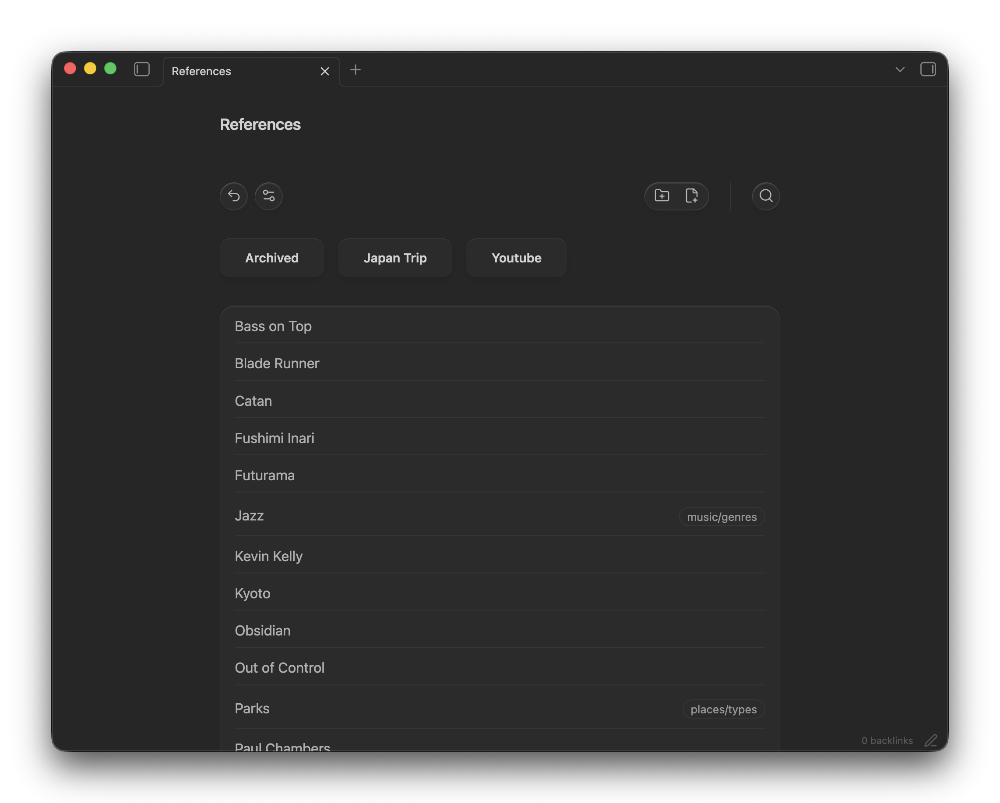

# Explorer changelog

## 1.3.1(02-06-2026)

### Hompage can can have an inbox for new notes

- newly created notes from Hompage would be created at whatever inbox location you decide. default is `./*` meaning root.

### Bug fixes

- shading issues in dark mode in mobile have been fixed
- tags have been fixed and no longer act wierd when they feel like
- action icon on mobile now match obsidian by size width and padding to look consistent.

## 1.3.0 (01-06-2026)

This release changes how Explorer handles folders that do not yet have folder
notes, adds temporary folder views, and makes the new behavior safer for
existing users.

### Temporary folder views

- Explorer can now open a folder even when its matching `Folder/Folder.md`
  note does not exist yet.
- New installs use the new default: clicking a folder card opens a temporary
  folder view, while clicking the unresolved folder-note link or editing/saving
  that view creates the Markdown folder note.
- Existing users keep the old missing-folder-note behavior by default: missing
  folder notes are still created when navigating to a folder.
- Added a `Missing folder notes` setting with three modes:
  - `Links and edits`
  - `Always create`
  - `Edits only`
- `Ask before creating folder notes` now also applies when saving or editing a
  temporary folder view.

### Safer folder-note sync

- Added optional folder-name sync: when a folder or its matching folder note is
  renamed, Explorer can keep the other side named with it.
- Folder/folder-note rename sync is now safer for existing users. New installs
  can use rename sync by default, but existing users are migrated with sync
  disabled unless they already configured it.
- Open temporary folder views now keep following their folder when it is renamed.

### Navigation and UI

#### Mobile `Action bar` Redesign

Now the mobile UI for action bar looks more "Glassy" and Native (when `use-glass` is on).

#### Obsidian sidebar folder notes

- Added settings for hiding folder-note files from Obsidian's sidebar file
  tree.
- When folder-note files are hidden, clicking folder names in the sidebar can
  now open existing folder notes or temporary folder notes.
- Sidebar folder-name clicks are strict: collapse arrows and row whitespace keep
  Obsidian's normal sidebar behavior.

#### Additional Changes

- The parent button and `Go to parent folder` command now open temporary folder
  views for missing parent folder notes unless the user chooses `Always create`.
- Missing folder-note links no longer imply note creation when the selected
  behavior is `Edits only`.
- Mobile folder grids now keep a three-column rhythm for sparse folder lists, so
  one or two folders do not stretch awkwardly on wider mobile screens.
- The action bar layout was tightened for desktop and mobile.

## 1.2.5 (29-05-26)

### Introducing Modern List

Previously known as `Mobile list`, the modern list is now available on desktop as well. To use it, choose `Modern` under `List style` in the block settings. To return to a regular Markdown list, choose `Markdown`, or choose `Plain Markdown` for a list without bullets.

- To use the modern list for all list views, update the `Default block settings` in the plugin settings.

- You can now choose regular Markdown lists instead of the modern list on mobile from the plugin settings.

### Bug fixes

- Fixed line wrapping issues in the cards view.
- List dragging now uses only the title as the drag preview.
- Input corners are rounded again.

### Breaking changes

- The `Use bullets in lists` setting was removed. Use the `Plain Markdown` list style instead.

## 1.2.4 (29-05-26)

- fix style issues caused by `css` variables value changes in Latest obsidian version `1.130` and additional layout issues.
- fixed mobile list not opening link when pressed on the edge
- added hectic feedback on context menu on mobile

## 1.2.3 (28-05-26)

- Urgent fix for Mobile folder view grid to have 3 columns again

## 1.2.2 (28-05-26)

- Added an optional setting to force folder notes into reading mode, preventing
  the editor cursor from interfering with Explorer blocks.
- Removed mobile drag-and-drop. Long-press works better for context menus on
  mobile, and folder context menus now target the folder itself so Obsidian's
  move action moves the folder instead of only moving its folder note.
- Fixed pin toggles so the UI updates immediately after frontmatter changes.

## 1.2.1 (27-05-26)

Add drag and drop for mobile as well.

## 1.2.0 (27-05-26)

Explorer started as a way to browse folders. Now you can manage them too.

Drag notes, rename folders, hide archives from specific views, open your
homepage in new tabs — all without leaving your note.

### Organize directly from Explorer

- On desktop, drag notes and folders into another displayed folder to move them
  without leaving the note.
- Drag a note or folder onto the parent button to move it up one level.
- Dragging a folder note moves its folder and asks for confirmation first.
- Rename notes and folders from their right-click menu. Renaming a folder
  keeps its matching folder note named with it.
- Right-click notes and folders for pinning and deletion, plus quick
  navigation to nested folder notes.
- Folder deletion now clearly warns that everything inside the folder will be
  deleted before continuing.

### Make Explorer your home base

- Optionally open your Explorer homepage whenever you create a new empty tab,
  so a fresh workspace can start at your vault's home.
- Exclude selected nested folders and everything inside them from an individual
  Explorer view, useful for archives, templates, or areas that should stay out
  of a dashboard.
- Choose whether nested folder notes appear alongside notes in deeper Explorer
  views.

### A clearer, more polished view

- Folder notes are now visibly marked as folders in card and list views.
- Folder cards handle long names more cleanly and have a refreshed layout.
- Tags in list view stay alongside their note title, and pinned notes have a
  cleaner position in the list.
- Cards using the default footer now show last-edited time in the current
  folder, better reflecting recent work.
- Folder notes shown with folder information now display their containing
  folder correctly.
- Opening a folder now consistently uses its matching nested folder note,
  rather than a same-named note in the parent folder.

### Changed behavior

- The `Only Markdown` displayed-notes option now leaves folder notes out of the
  notes list; folder navigation remains available through folder buttons.

היי שלום

## 1.1.15 (24-05-26)

### New

- Added `sortBy: "nameDesc"` for reverse filename sorting, useful for date-prefixed notes like `YYYY.MM`.
- Added a confirmation dialog before creating missing folder notes, with a persisted "Don't show again" option (can be toggled via settings)

## 1.1.14 (23-05-25)

### New

- added `Explorer: toggle pin for active note` command

### Fix

- fixed visual problems in mobile
- Fixed search in mobile while live editing

## 1.1.13 (23-05-26)

### Improved search:

- Support multi query. For example :`#important #todo @myproject` will search for a file inside `myproject` folder that contains both `#important` and `#todo` tags.
- Show exact match first and then weaker matches (if query is `#work` then `#work` will show before `#homework`)

### Bug fixes

- fixed `Explorer: go to parent folder` command
- fixed `go to folder` button incorrectly showing on action–bar when inside root / homepage.

## 1.1.12 (21-05-26)

This release improves Explorer navigation, homepage handling, and mobile UI polish.

### Highlights:

- Added configurable homepage navigation.
- Homepage can be disabled, or left empty to use the vault name.
- Missing homepages are created automatically with a useful Explorer template.
- Added command palette actions for "Go to homepage" and "Go to parent folder".
- Moved parent/homepage navigation into reusable vault actions so UI and future commands share the same behavior.
- Hid parent navigation when there is no valid destination.
- Improved layout spacing control through semantic Divider sizes.
- Refined mobile list and glass styling.
- Fixed the cards view mobile grid selector.
- Updated the README with current usage, navigation, commands, configuration, development, and contributing notes.

## 1.1.11 (21-05-26)

fix css linting error

## 1.1.10 (20-05-26)

Glass is more accisble in mobile now, fixed tags vertical scroll bug and fixed folder icon showing when empty bug.

## 1.1.9 (20-05-26)

Improve behaviour and performance in live-preview mode, mainly fixing the cursor and margins.

## 1.1.8 (19-05-26)

This release focuses on UI enhancements, mainly tags ui and list view

## 1.1.7 (18-05-26)

Full Changelog: 1.1.6...1.1.7

## 1.1.6 (18-05-26)

Full Changelog: 1.1.5...1.1.6

## 1.1.5 (14-05-26)

polish mobile ui and general performance improvement

## 1.1.4 (14-05-26)

Add command palette support for basic functionality, polish UI, and general optimization.

### Highlights:

- adds command palette support for inserting explorer blocks and creating explorer folders
- improves mobile list UI with a dedicated note-style mobile layout
- cleans up action bar and glass styling behavior
- reduces CSS over-abstraction and moves styling ownership closer to each component

## 1.1.3 (13-05-26)

Full Changelog: 1.1.2...1.1.3

## 1.1.2 (12-05-26)

- Raise minAppVersion to 1.4.4 for FileManager.processFrontMatter compatibility
- Use window timer APIs to satisfy Obsidian validator guidance
- Keep release assets aligned with repository manifest and versions.json

## 1.1.1 (12-05-26)

- Fix Obsidian compatibility checks
- Raise minAppVersion to 1.4.0
- Update versions.json for the new minimum supported Obsidian version

## 1.1.0 (06-02-26)

UI refresh and mobile improvements.

## 1.0.1 (01-02-26)

### What's New

#### Glass UI Redesign

Complete visual overhaul with a glass/frosted style — buttons, action bar, folder cards, and badges all use the new aesthetic. Toggleable via the `useGlass` setting.

#### Inline Search

Search now lives inside the action bar instead of a separate row. Faster too — debounced pipeline with no lag, flat BFS traversal across subfolders, and search by `#tag` or `@foldernote` prefixes.

Atomic Component System  
New reusable UI primitives: ActionButton, IconButton, Badge, and layout components (Group, Stack, Separator). Cleaner, more consistent look across card and list views.

#### Parent Folder Button

Replaced breadcrumbs with a simple parent-folder navigation button. Works better on mobile.

#### Pagination Opt-Out

New `usePagination` setting — disable it to show all files at once without page controls.

#### Mobile Polish

Better layout on mobile devices — breadcrumbs hidden, parent button shown instead, improved touch targets.

#### Other Improvements

- Pinned files (`pin: true` / `fav: true` in frontmatter) shown at top with heart icon
- PDF files properly hidden when `onlyNotes` is enabled
- RTL pagination direction fix
- CSS split into component-scoped files for maintainability

## 1.0.0 (23-01-26)

Initial release

### Features:

- Card and list view modes
- Sorting by date, name, or last edited
- Pagination and search
- Folder notes support
- RTL support
- Pinned files
