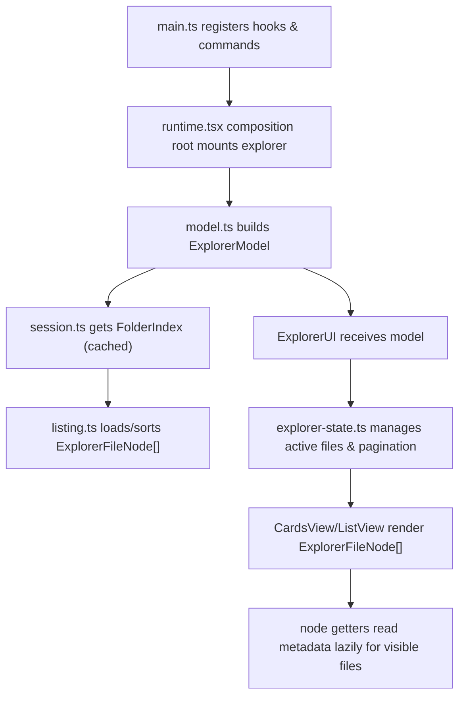

# Current structure and data flow.

## **File Roles**

`main.ts` is the entry point. It loads/saves the global plugin settings, registers views, hooks, event listeners, commands, and maps sidebar clicks.

`runtime.tsx` is the composition root. It initializes the workspace-level `ExplorerSession` cache and the vault-level refresh handlers, builds the `ExplorerModel` data structure for a given folder block, and mounts the React-based `ExplorerUI`.

`src/explorer/settings/` owns plugin-wide and block-overridden settings:

- `schema.ts` -> declarative definitions for setting fields, defaults, constraints, and visibility conditions.
- `types.ts` -> machinery for field schemas and validator types.
- `logic.ts` -> default block configurations, normalization, schema migration helpers, parse/serialize overrides.
- `index.ts` -> public settings API export.

`src/explorer/vault/` owns file and folder mutations:

- `create.ts` -> workflows for creating folders and notes.
- `edit.ts` -> pinning, unpinning, and updating folder-note frontmatter.
- `move.ts` -> moves notes and folders (validating and triggering renames via fileManager).
- `block-update.ts` -> formats and writes block settings back to the active Markdown block.

`src/explorer/navigation/` manages navigation behaviors:

- `folder-notes.ts` -> detects folder notes, handles open/create navigation, and goes to parent folder.
- `homepage.ts` -> resolves homepages, initializes template files, and handles empty-tab hooks.
- `virtual-folder-note.ts` -> registry type and utilities for opening dynamic (virtual) folder views.

`src/explorer/data/` owns session caches and persistence:

- `session.ts` -> cache for folder contents, memoizing indexes by path and configuration options.
- `folder-index.ts` -> implements the BFS/DFS file/folder scanner (direct vs. deep traversal).
- `folder-data-store.ts` -> FolderDataStore class persisting block settings overrides for file-free folder notes (saved to `folder-data.json`).

`src/explorer/lib/` houses pure helper functions and domain objects:

- `nodes.ts` -> file and folder wrapper objects (ExplorerFileNode, ExplorerFolderNode) with lazy getter caches.
- `listing.ts` -> search query compilation, sorting rules, and filtering criteria.
- `folder-note.ts` -> low-level folder-note detection and file creation logic.

`src/explorer/integration/` registers handlers for Obsidian host interfaces:

- `commands.ts` -> registers Command Palette commands.
- `file-explorer-folder-notes.ts` -> sidebar tree integrations (collapsing rows, intercepting clicks, hiding files).
- `folder-data-sync.ts` -> event handlers that sync virtual folder note settings upon rename/move/delete.
- `folder-note-conversion.ts` -> converts virtual folder notes to markdown files and vice-versa.
- `folder-note-rename-sync.ts` -> renames folder notes in sync with their directory.
- `reading-mode.ts` -> forces folder notes into reading mode to prevent cursor interference.
- `virtual-folder-note-view.ts` -> ItemView for displaying file-free folder note blocks in Obsidian workspace leafs.

`src/ui/` houses the React components, styles, and states:

- `explorer-ui.tsx` -> composition root of the React view (cards, lists, pagination, action bars).
- `explorer-state.ts` -> React hooks that compile listings, manage debounce search, pagination, and refresh ticks.
- `context-menu.ts` -> context menus for right-clicks on folders/notes.
- `drag-drop.ts` -> desktop drag-and-drop operations for moving files/folders inside Explorer.
- `settings-tab.ts` -> settings tab UI panel inside Obsidian preferences window.
- `modals/` -> custom popup windows like `settings-modal.ts` and `prompt-modal.ts`.
- `components/` -> layout components (cards, lists, buttons, pagination bar).
- `styles/` -> CSS modules compiled into `styles.css` by esbuild.

---

## **Current Data Flow**

```txt
main.ts
  registers Obsidian sidebar listeners, commands, and virtual view types
  intercepts navigation to open VirtualFolderNoteView if target folder note doesn't exist (when virtual notes are enabled)

src/explorer/runtime.tsx
  resolves default block settings with initial overrides
  instantiates an ExplorerModel using workspace settings, current path, and parent folder TFolder

src/explorer/data/session.ts
  checks cache for a FolderIndex or spawns FolderIndex loader to list children via file-system BFS traversal

src/explorer/lib/nodes.ts
  materializes cheap ExplorerFileNode and ExplorerFolderNode wrapper objects with lazy metadata getters (cached per-instance)

src/ui/explorer-ui.tsx
  mounts inside the host block/view and passes the model to useExplorerState

src/ui/explorer-state.ts
  resolves active listings based on active search mode (immediate files vs. debounced search query BFS)
  applies sort/filter rules defined in listing.ts
  paginates results based on display settings and yields visibleFiles array

src/ui/explorer-ui.tsx
  renders the paginated visibleFiles list (via CardsView or ListView)
  components read lazy node properties (tags, description, pinned state) at render time
```

### diagram



---

## **Important Boundaries**

```txt
nodes.ts        = pure domain wrappers caching metadata reads
session.ts      = handles performance cache for folder traversals
listing.ts      = rules for search queries, tagging, sorting
state.ts        = manages UI interaction, debouncing, active page indexing
actions.ts      = central method dispatch (facade connecting UI to navigation/vault/lib)
folder-data-*   = persists and syncs file-free folder note preferences
ui/             = UI layers consuming model attributes and action commands
```

### Caveats to keep in mind

- **Node metadata caches are per-instance:** `ExplorerFileNode` caches its metadata. Operations that mutate state (like pin toggles) explicitly update that node instance's cache and bump the `metadataTick` to trigger UI updates.
- **`allFiles` search cache is persistent:** `useSearchState` keeps the full subtree in component state after the search panel closes to avoid re-scanning the vault when reopened.
- **Mobile overrides:** Mobile does not support drag/drop. Mobile relies on long-press context menus. Drop targets are disabled on mobile views.
- **FolderDataStore asynchronous flushes:** Key modifications in the virtual folder note store are debounced and flushed to `folder-data.json` after 250ms.
- **Virtual note deletion upon file creation:** If a physical Markdown file is created at a folder matching a virtual folder note path, `FolderDataSync` automatically clears the virtual store entry to prevent conflicting configurations.
